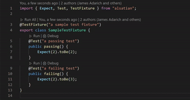
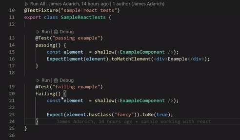

# alsatian

Want to run your [alsatian](https://github.com/alsatian-test/alsatian/packages/alsatian) tests directly in VSCode? Well this is the extension for you! Don't take my word for it though, check out them GIFs below!

## Features

### Runing a Test in the Editor

Want to run an individual test? Just click the "Run" button above the method.



#### Debugging a Test

Not sure what the problem is with a test? Click the "Debug" button and find out.



### Test Setup

If you have something to setup before running tests then all you need to do is drop an `.alsatianrc.json` in your project root referencing the required files (as below)

.alsatianrc.json
```json
{
    "tsconfig": "./custom-tsconfig.json", // will default to find nearest file called "tsconfig.json" to the file
    "preTestScripts": [
        "./path/to/test-setup.ts"
    ]
}
```
